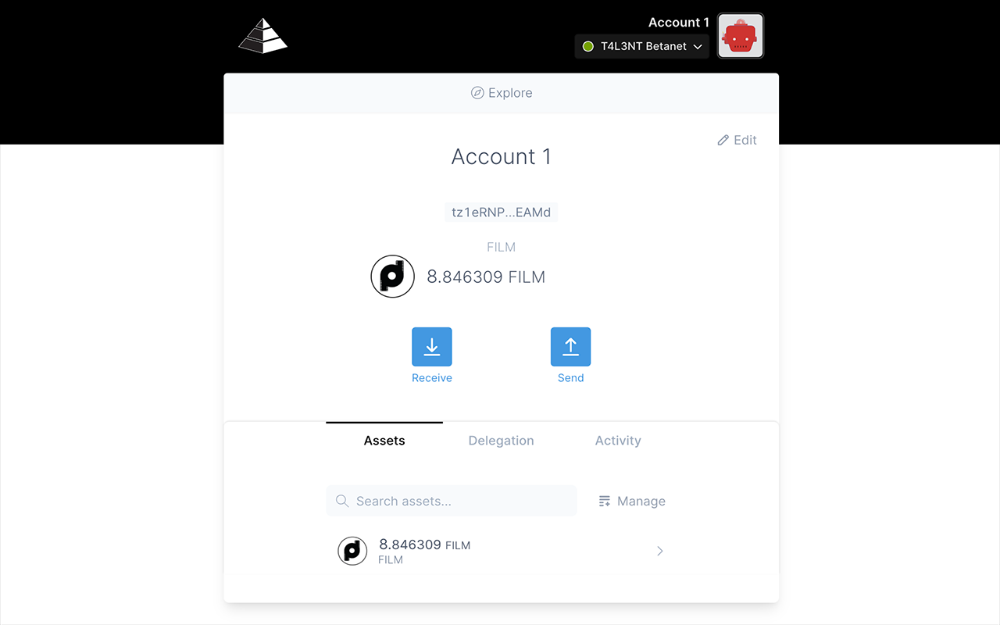

# Sentinel - T4L3NT Wallet

Cryptocurrency wallet for [T4L3NT blockchain](https://tlnt.net) as Web Extension for your Browser.<br>
Providing ability to manage NFT, tlnt tokens and interact with dApps.



<hr />

## ▶️ Install

You can install Sentinel Wallet right now: https://www.tlnt.net/sentinel-wallet.

## Browser Support

[](https://www.tlnt.net/s/chrome.zip)
</br>49 & later ✔ 

## 🚀 Quick Start

Ensure you have:

- [Node.js](https://nodejs.org) 10 or later installed
- [Yarn](https://yarnpkg.com) v1 or v2 installed

Then run the following:

### 1) Clone the repository

```bash
git clone https://github.com/Decentralized-Pictures/sentinel-wallet.git && cd sentinel-wallet
```

### 2) Install dependencies

```bash
yarn
```

### 3) Build

Builds the extension for production to the `dist` folder.<br>
It correctly bundles in production mode and optimizes the build for the best performance.

```bash
# for Chrome by default
yarn build
```

Optional for different browsers:

```bash
# for Chrome directly
yarn build:chrome
# for Firefox directly
yarn build:firefox
# for Opera directly
yarn build:opera

# for all at once
yarn build-all
```

### 4) Load extension to your Browser


## 🧱 Development

```bash
yarn start
```

Runs the extension in the development mode for Chrome target.<br>
It's recommended to use Chrome for developing.
