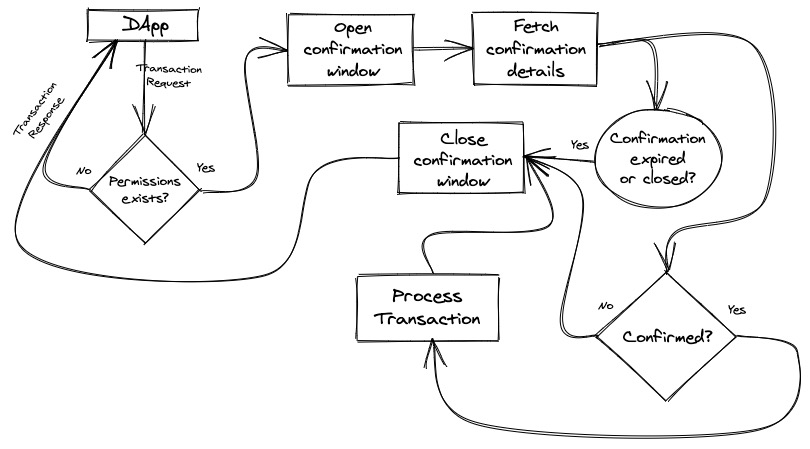

# Documentation

This doc describes how Sentinel Wallet works internally.

## Architecture

The application consists of three main parts: UI scripts, one Background script, and the Content script that is injected on every page.

All the communications in the application work through the internal `Intercom` module. It's a wrapper over native means of communication in the browser extension.

### Background Script

- Only one per application. It starts as soon as the browser is started and runs until the browser closes.
- Listens to requests from UI scripts and Content script. It can broadcast messages to them and also notify them directly.

### Actions

- Top-level function set.
- Work with Store, browser API and can call the methods of the current Vault instance.

### Store

- Very simple in-memory storage by [Effector](https://github.com/zerobias/effector). It displays the current state of the wallet.
- Exposes a public version of its state, which is accessible from the front-end at any time.
- Events: `inited`, `locked`, `unlocked`, `accountsUpdated`, `settingsUpdated`.

### Vault

- A class describing general wallet behavior.
- Its instance is created during initialization, and stored in the state of `Store`. One instance is created per one wallet (one seed-phrase etc).
- Contains only one property: `passKey` - private, typeof CryptoKey, byte projection of the user's password.
- Manages all sensitive data: encrypts/decrypts, stores, deletes.
- Methods that require a mandatory password are static so that they don't have access to an already existing key from the context.
- Also implements migrations because it works with the storage.

## DApps

To communicate with DApps, the wallet inherits the behavior of the [tzip10](https://gitlab.com/tzip/tzip/-/blob/master/proposals/tzip-10/tzip-10.md) standard: first - permissions, then - transaction requests.

## Transaction flow

The image below shows how DApp transactions are processed.

Internal transactions (inside wallet) works in the same way, but with minimal technical differences.
